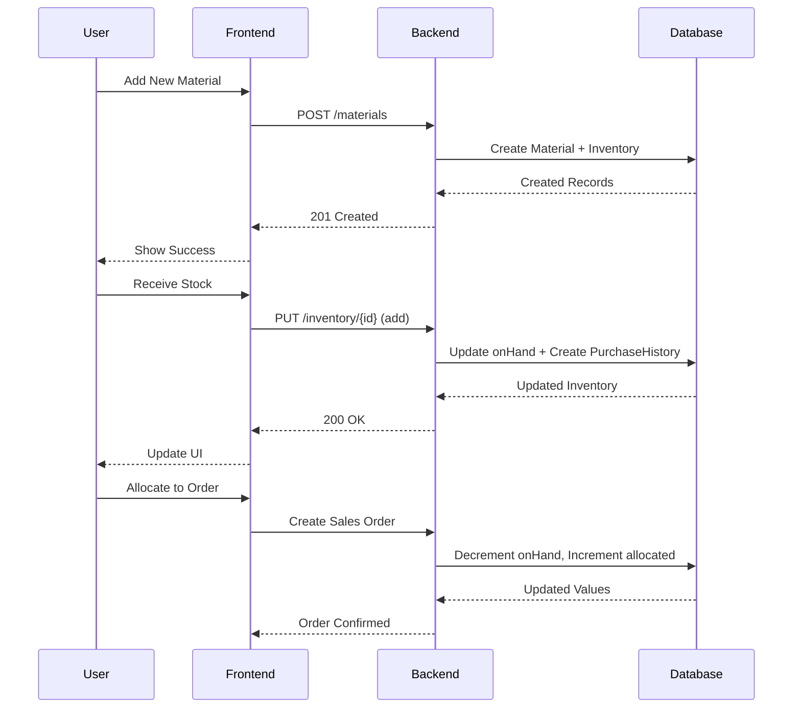

# Cloudforge Project


## Table of Contents
- [Cloudforge Project](#cloudforge-project)
  - [Table of Contents](#table-of-contents)
  - [Overview](#overview)
  - [Backend APIs](#backend-apis)
  - [Technology Stack](#technology-stack)
  - [Running Locally](#running-locally)
  - [What I Would Add](#what-i-would-add)

## Overview
This is an example work flow for adding materials, creating inventories, adding and approving quotes, managing shipments, invoices, and payments, and made with TypeScript 

You can access the user interface / fronted at [https://cloudforge-frontend.vercel.app/](https://cloudforge-frontend.vercel.app/) – developed using React, Vite, and Typescript.

The backend APIs are hosted at [https://cloudforge-production.up.railway.app](https://cloudforge-production.up.railway.app) and are described below.




## Backend APIs

```
GET /materials – get list of all material objects
POST /materials – add new material object(s) to database

GET /inventory – get list of all inventory objects
PUT /inventory/:materialId – add new inventory object related
                              to material being added to database

GET /quotes – get list of all quote objects
POST /quotes – add new quote object(s) to database
POST /quotes/:id/approve – approve quote based on quote id, update allocated
                            stock, generate sales order automatically

GET /sales-orders – get list of all sales order objects
POST /sales-orders/:id/shipments – generate new shipment and
                                    invoice relating to sales order id

GET /invoices – get list of all invoice objects
POST /invoices/:id/payments – generate new payment relating to
                                invoice id, updates status of invoice
```

## Technology Stack
- Typescript Node.js 10.9.2 + Express 5.0.1 for backend
- PostgreSQL 17 + Prisma 6.6 for database
- Vite.js 6.3.1 + React 19 + Tailwind CSS 3.4.17 + Typescript 5.7.2 for frontend
- Railway + Vercel + Neon for deployment

## Running Locally
1. Pull Postgres Image from Docker and get a local database URL, either in Docker Desktop or via: ` docker run --name {your_database_name} -e POSTGRES_PASSWORD={your_password} -p 5432:5432 -d postgres `
   1. Make sure you get the database url from the docker image (in Docker Desktop settings and/or logs)
2. `git clone git@github.com:Rowan-McKereghan/cloudforge.git`
3. `cd cloudforge-backend`
4. `npm install`
5. Create .env file and set DATABASE_URL={your_database_url}
6. `npx prisma generate`
7. `npx prisma migrate dev --name {your_migration_name}`
8. `npx ts-node ./prisma/seed.ts`
9. `npm run start`
10. `cd ../cloudforge-frontend`
11. `npm install`
12. Create .env file and set LIVE_URL=`http://localhost:3000`
13. `npm run dev`
14. The frontend should now be live at `http://localhost:5173`, or whatever you have `vite.config.js` ports set to.

## What I Would Add

- Unit Conversion
  - MSC units and data are very particular and need to be precise. If given more time, I would implement a way for units, prices, and measurements to be automatically converted between each other.
- AI Agents + PDF parsing
  - Manual workflow allows users to create quotes, but I would probably use [Weaviate batch uploads](https://weaviate.io/developers/weaviate/manage-data/import) to agentically automate this process, because it allows both for PDF parsing and for automatic conversion of parsed data into specific interface formats, and is quite fast with RAG and vector database functionality built in.
- User Authentication
  - Creating a secure auth flow would have eaten up a lot of time in development just through setup, so I omitted it. However, planning-wise, it's quite simple: create a new database key for each user in the cluster so that only users who are signed in can access data, and each person's data is kept separate and encrypted based on the keys. 
- Intelligent pricing suggestions and inventory sales suggestions
  - In the spec, this was suggested for a stronger submission – I would probably use OpenAI/Anthropic and do some prompt engineering to suggest what default prices a user should pick. Given a large amount of user data and a significant amount of time, I could also create an intelligent averaging algorithm that could aggregate user data and suggest prices and inventory sales intelligently based on past users' histories. 
